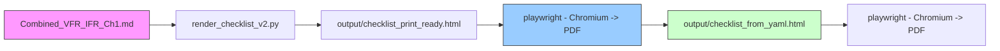

Checklist conversion toolkit

This repository contains scripts and templates to convert checklist source Markdown (Combined_VFR_IFR_Ch1.md) into a duplex, US half‑letter laminated checklist.

Setup

1. Install system tools: `pandoc` and `unzip`.
2. Install a global Python environment manager: `uv` (preferred) — install with `pipx install uv` or `python3 -m pip install --user uv`.
3. Create a project environment and install Python deps via `uv sync` (or `uv venv` + `uv pip install --project .`) and run project commands with `uv run` (recommended). Alternatively install required packages manually into a venv.


This repo supports two workflows:

- Recommended (uv + package.json):

```bash
# install uv globally (once)
python3 -m pip install --user pipx && python3 -m pipx ensurepath
pipx install uv

# install project Python deps declared in package.json
# Preferred sequence with modern uv:
# 1. Create/ensure project venv: uv venv .venv
# 2. Install deps into project venv: uv pip install --project .
# 3. Run commands in the project environment: uv run python scripts/...
# Example (recommended):
uv venv .venv --allow-existing -p 3.12 && uv pip install --project .

# To run project scripts use uv run, which ensures the project environment is active:
# uv run python3 scripts/check_setup.py
```

- Fallback (venv) — works everywhere:

```bash
python3 -m venv .venv
. .venv/bin/activate
# Install required runtime packages (declared in package.json). If not using uv,
# install them with pip:
python -m pip install PyYAML playwright
python -m playwright install chromium
```

Helper script (Debian/Ubuntu):

```bash
./scripts/install_deps.sh
```

Check your setup:

```bash
python3 scripts/check_setup.py
```


Required Dependencies

- Python 3.8+
- pandoc (DOCX → Markdown and small MD→HTML conversions)
- unzip (used to extract images from DOCX)
- PyYAML (required by rendering scripts)
- playwright (required for HTML→PDF rendering using Chromium)

Notes

- `uv` is the recommended global environment manager for running project Python commands. It is not a runtime dependency of the built artifacts; it only manages virtual environments and helps run Python commands consistently.
- weasyprint and wkhtmltopdf are no longer recommended and have been removed from the toolchain. Use playwright for PDF generation.

Checklist generation flow



Quick build (HTML proof):

```bash
# from repo root (uses Combined_VFR_IFR_Ch1.md in the repo root)
./templates/html_css/us-halfletter/build.sh
```

Quick build (HTML -> PDF using Playwright):

```bash
# from repo root (uses Combined_VFR_IFR_Ch1.md in the repo root)
./templates/html_css/us-halfletter/build.sh
```

Outputs will be written to `output/`.

Heading / Page-break conventions
===============================

This project relies on a simple, well-defined mapping between Markdown
heading levels and the printed kneeboard layout. Keep these rules in mind
when editing the source Markdown (Combined_VFR_IFR_Ch1.md):

- Use H1 (#) once at the top of the document for the overall checklist
  title. The renderer will use the first H1 as the printed title band.
- Use H2 (##) to define top-level procedure groups that should appear as
  separate cards within a single kneeboard page segment. Each H2 becomes
  a <section class="card"> in the output HTML.
- Use H3 (###) for logical subsections that must stay visually grouped
  inside their parent H2 card (they render as .subsection inside the
  H2 card). The renderer hides H3 text in print but keeps the item
  groups together for layout safety.
- Use the explicit page break marker <!-- PAGE_BREAK --> on a line by
  itself to force a new kneeboard card. The renderer will partition the
  Markdown at these markers: everything between markers becomes one
  printed <main class="columns"> card (two-column layout). Place the
  marker on the line immediately before the H2 that should start the
  next card (no blank line between marker and the heading).

Automatic hierarchy normalization
--------------------------------

To reduce accidental layout drift (for example, many H2s in the same
segment causing them to render as separate cards within one printed
page), we provide a helper script `scripts/normalize_hierarchy.py`.

- Behavior: for each PAGE_BREAK-delimited segment the script keeps the
  first H2 as a top-level card and converts subsequent H2 headings to
  H3. This preserves author intent: sections that belong on the same
  physical card remain grouped under the first H2.
- Usage examples:

```bash
# produce a normalized copy (does not modify original)
python3 scripts/normalize_hierarchy.py Combined_VFR_IFR_Ch1.md

# apply in-place (will overwrite Combined_VFR_IFR_Ch1.md)
python3 scripts/normalize_hierarchy.py --inplace Combined_VFR_IFR_Ch1.md
```

If you prefer manual control, do not run the script and instead ensure
you use H2/H3 intentionally per the rules above. The validator will
still check that <!-- PAGE_BREAK --> markers exist where required.

Future session notes
--------------------

These are actionable ideas and decisions to pick up in future work:

1) Allow selective section spanning across columns
   - Goal: let specific sections (e.g. IFR Performance table, V SPEEDS,
     and overall page headings) span the full width of the card instead
     of being constrained to one column. This improves readability for
     wide tables and compact numeric blocks.
   - Implementation ideas:
     - Introduce an explicit block marker in Markdown (e.g. <!-- SPAN:full -->)
       that the renderer recognizes and emits as a full-width <div class="span-full">.
     - Alternate: allow H2 metadata (front-matter style) such as
       `## 📘 IFR PERFORMANCE PROFILES {span="full"}` and parse with the
       renderer to set a data attribute.
     - CSS: a .span-full rule that uses column-span: all or places the
       block outside the column flow so it occupies the whole card.

2) Column breaks and tall mnemonic sections
   - Problem: the IFR ACRONYMS / MNEMONICS block is too tall to fit.
   - Options:
     - Allow explicit <!-- PAGE_BREAK --> markers as already in use to
       split long lists into multiple cards; provide guidance to authors
       recommending a page break before very long enumerations.
     - Support a finer-grained marker <!-- COLUMN_BREAK --> to force a
       column break inside a card when appropriate (renderer emits a
       <span class="col-break"></span> that CSS targets with
       break-after: column).
     - Provide a preprocessor script that detects long list blocks and
       suggests sensible split points (based on item count or visual
       table height). We already have check_page_fit.py which can be
       extended to suggest exact insertion lines.

3) Design improvements & agentic design process
   - Goal: improve visual clarity and make the kneeboard more modern.
   - Steps:
     - Run a design spike: create 2–3 alternate visual themes (compact,
       high-contrast, soft) and produce HTML proofs for stakeholder review.
     - Use small A/B tests with screenshots to pick typography, color,
       and spacing; automate screenshot generation per theme.
     - Add a design token file (JSON) and a small script to generate
       checklist.css from tokens; allows programmatic theming.
     - Establish a short PR template for visual changes requiring
       screenshots and a screenshot-based regression check in CI.

These notes should be the starting point for scoped follow-ups. If you
want, I can convert these into issues/todos and/or implement the CSS
support for full-width blocks and a column-break token as a next PR.
