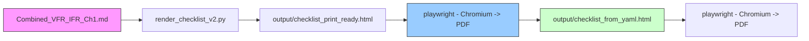

Checklist conversion toolkit

This repository contains scripts and templates to convert checklist source Markdown (Combined_VFR_IFR_Ch1.md) into a duplex, US half‑letter laminated checklist.

Setup

1. Install system tools: `pandoc` and `unzip`.
2. Install a global Python environment manager: `uv` (preferred) — install with `pipx install uv` or `python3 -m pip install --user uv`.
3. Create a project environment and install Python deps via `uv sync` (or `uv venv` + `uv pip install --project .`) and run project commands with `uv run` (recommended). Alternatively install required packages manually into a venv.


This repo supports two workflows:

- Recommended (uv + package.json):

```bash
# install uv globally (once)
python3 -m pip install --user pipx && python3 -m pipx ensurepath
pipx install uv

# install project Python deps declared in package.json
# Preferred sequence with modern uv:
# 1. Create/ensure project venv: uv venv .venv
# 2. Install deps into project venv: uv pip install --project .
# 3. Run commands in the project environment: uv run python scripts/...
# Example (recommended):
uv venv .venv --allow-existing -p 3.12 && uv pip install --project .

# To run project scripts use uv run, which ensures the project environment is active:
# uv run python3 scripts/check_setup.py
```

- Fallback (venv) — works everywhere:

```bash
python3 -m venv .venv
. .venv/bin/activate
# Install required runtime packages (declared in package.json). If not using uv,
# install them with pip:
python -m pip install PyYAML playwright
python -m playwright install chromium
```

Helper script (Debian/Ubuntu):

```bash
./scripts/install_deps.sh
```

Check your setup:

```bash
python3 scripts/check_setup.py
```


Required Dependencies

- Python 3.8+
- pandoc (DOCX → Markdown and small MD→HTML conversions)
- unzip (used to extract images from DOCX)
- PyYAML (required by rendering scripts)
- playwright (required for HTML→PDF rendering using Chromium)

Notes

- `uv` is the recommended global environment manager for running project Python commands. It is not a runtime dependency of the built artifacts; it only manages virtual environments and helps run Python commands consistently.
- weasyprint and wkhtmltopdf are no longer recommended and have been removed from the toolchain. Use playwright for PDF generation.

Checklist generation flow



Quick build (HTML proof):

```bash
# from repo root (uses Combined_VFR_IFR_Ch1.md in the repo root)
./templates/html_css/us-halfletter/build.sh
```

Quick build (HTML -> PDF using Playwright):

```bash
# from repo root (uses Combined_VFR_IFR_Ch1.md in the repo root)
./templates/html_css/us-halfletter/build.sh
```

Outputs will be written to `output/`.
